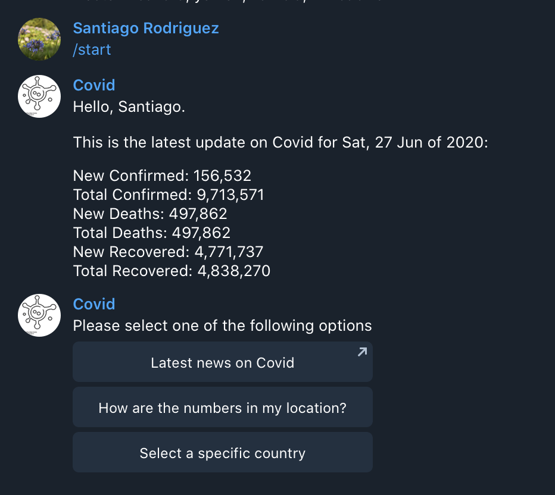
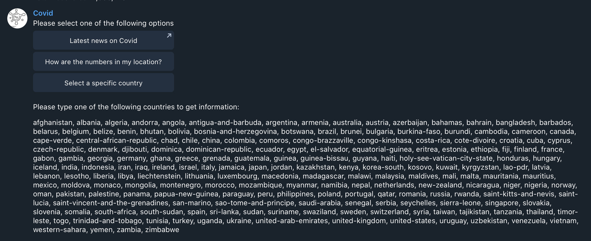
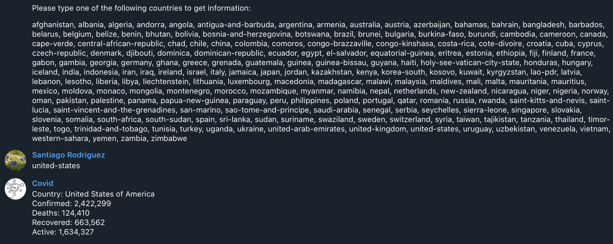

# Covid -> Your daily Covid update news

> Covid provides the latest data on how the Pandemia has evolved globally and by country over/ All through Telegram.

Provide the latest data from the Pandemic situation worldwide. [Start talking with Covid.](https://t.me/mv_covid_bot)

## Table of Contents

* [Getting Started](#getting-started)
* [About the Project](#about-the-project)
* [Built With](#built-with)
* [Acknowledgements](#acknowledgements)
* [License](#license)
* [Contact](#contact)

## Getting Started
You can chat directly with the bot by searching for @mv_covid_bot on Telegram. [Click here.](https://t.me/mv_covid_bot))

### Prerequisites
To install this project on your own and create another bot with the same logic, please be sure to install and use:

- Ruby,
- Gems within Ruby, 
- Heroku for deployment,
- Rspec for running tests.

### Install
- Fork this project into your local machine.
- Create a [bot token here](https://core.telegram.org/bots#6-botfather) and include it on a .env file. Save the variable as 'TOKEN'. 
- Open your project directory on your terminal
- Install gems by running "bundle install" on your terminal
- Run 'ruby bin/main.rb' on your terminal. 
- Open Telegram and start talking with @mv_covid_bot

### Usage
- The bot generates a main command menu by writing /start
- Follow the instructions. 

## Commands

### Start
Provide the main menu and the recent global numbers. 

### Send your location
Share your location to get the stats from your country

### See list of countries
Select the 'Select a specific country' to get a list of all of the current countries from which you can get data. 

### Type a specific country
Type a country from the list and see its stats up to date. 

## About The Project
This is a educational project as part of the Microverse Curriculum. 

## Built With

- Ruby version 2.6.5,
- Telegram/bot
- [Covid API](https://covid19api.com/)
- Rspec

## Tests
- Run rspec for testing bot and covid_api classes. This will mainly test that each country has the data with no problem. 

## Authors

👤 **Santiago Rodriguez**

- Github: [@santiagorodriguezbermudez](https://github.com/santiagorodriguezbermudez)
- Twitter: [@srba87](https://twitter.com/srba87)
- Linkedin: [@srba87](https://www.linkedin.com/in/srba87/)
- Email: [srba87@gmail.com](srba87@gmail.com)

## 🤝 Contributing

Contributions, issues and feature requests are welcome!

Feel free to check the [issues page](issues/).

## Show your support

Give a ⭐️ if you like this project!

## Acknowledgments

- Special thanks to The Ocicats team from Microverse!
- Maria Reyes for making the suggestion to work with Telegram
- Ruby gem: [Telegram Bot Ruby](https://github.com/atipugin/telegram-bot-ruby)

## 📝 License

Bot Icon of the virus by Arya Icons from the Noun Project
This project is [MIT](lic.url) licensed.
